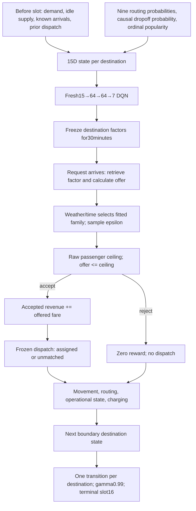

# V3 state and slot flow

```mermaid
flowchart TD
 A[Before slot: demand, idle supply, known arrivals, prior dispatch] --> S[15D state per destination]
 B[Nine routing probabilities, causal dropoff probability, ordinal popularity] --> S
 S --> D[Fresh15→64→64→7 DQN]
 D --> F[Freeze destination factors for30minutes]
 F --> R[Request arrives: retrieve factor and calculate offer]
 R --> E[Weather/time selects fitted family; sample epsilon]
 E --> P[Raw passenger ceiling; offer <= ceiling]
 P -->|reject| Z[Zero reward; no dispatch]
 P -->|accept| V[Accepted revenue += offered fare]
 V --> X[Frozen dispatch: assigned or unmatched]
 X --> U[Movement, routing, operational state, charging]
 Z --> U
 U --> N[Next boundary destination state]
 N --> T[One transition per destination; gamma0.99; terminal slot16]
```
