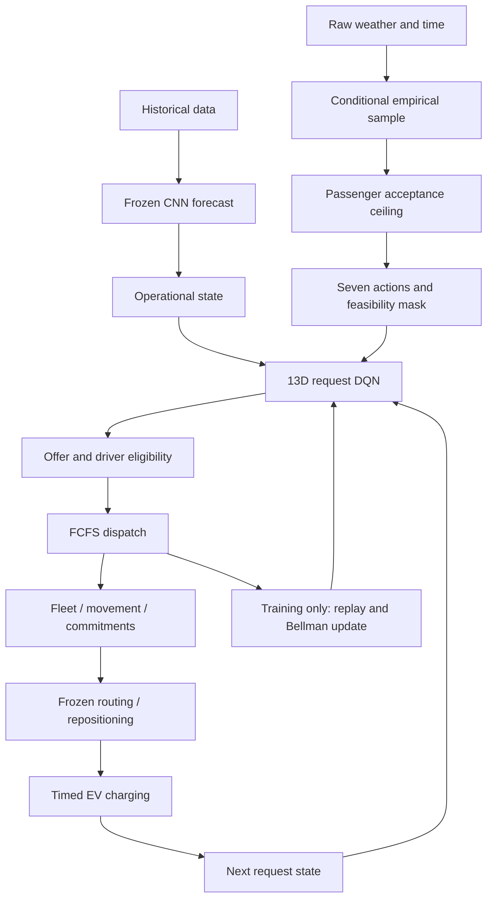

# Current workflow

Rendered diagram: [F1](../charts/F1.png).

```mermaid
flowchart TD
 H[Historical data] --> C[Frozen CNN forecast]
 C --> O[Operational state]
 W[Raw weather and time] --> S[Conditional empirical sample]
 S --> P[Passenger acceptance ceiling]
 P --> M[Seven actions and feasibility mask]
 O --> D[13D request DQN]
 M --> D
 D --> F[Offer and driver eligibility]
 F --> A[FCFS dispatch]
 A --> V[Fleet / movement / commitments]
 V --> R[Frozen routing / repositioning]
 R --> E[Timed EV charging]
 E --> N[Next request state]
 N --> D
 A --> B[Training only: replay and Bellman update]
 B --> D
```

March16 development is greedy inference without optimizer updates.
